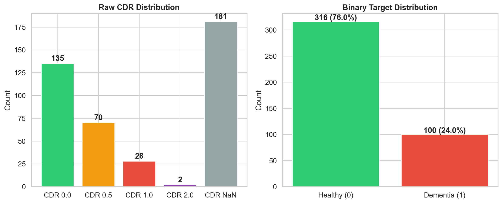
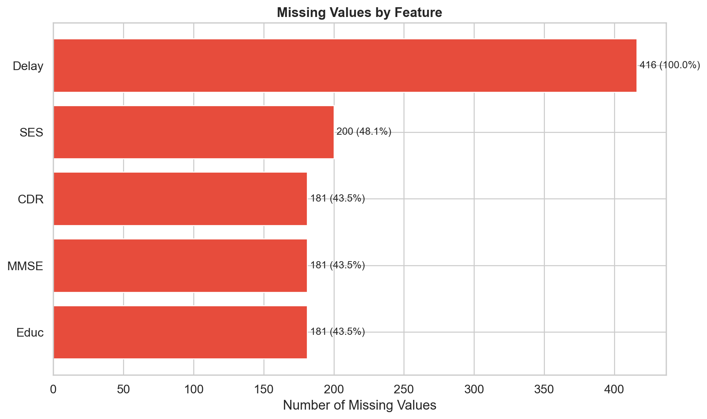
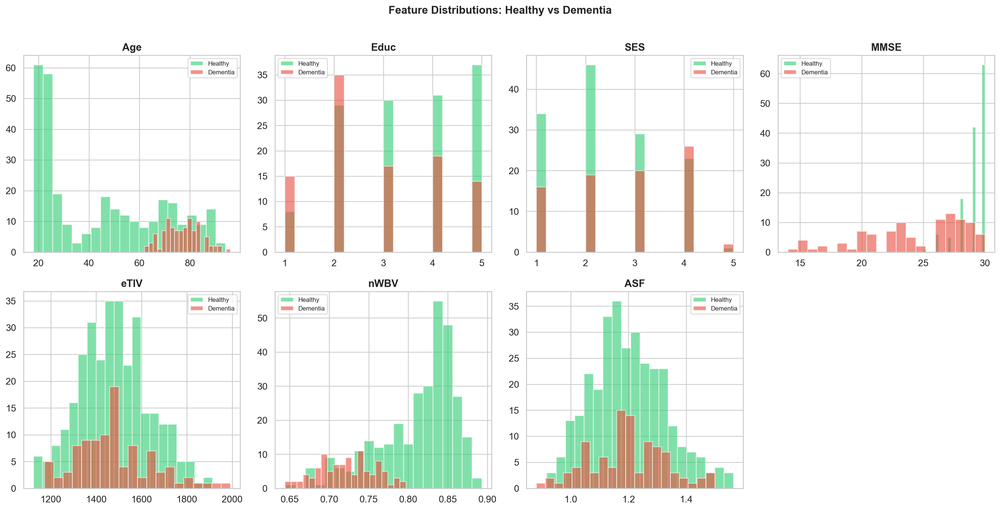
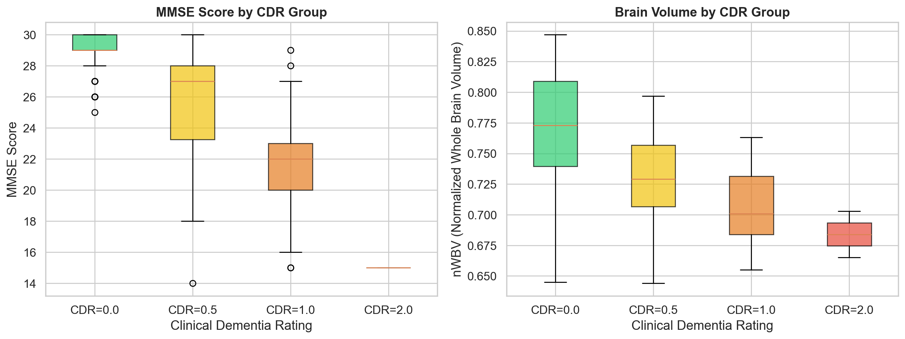
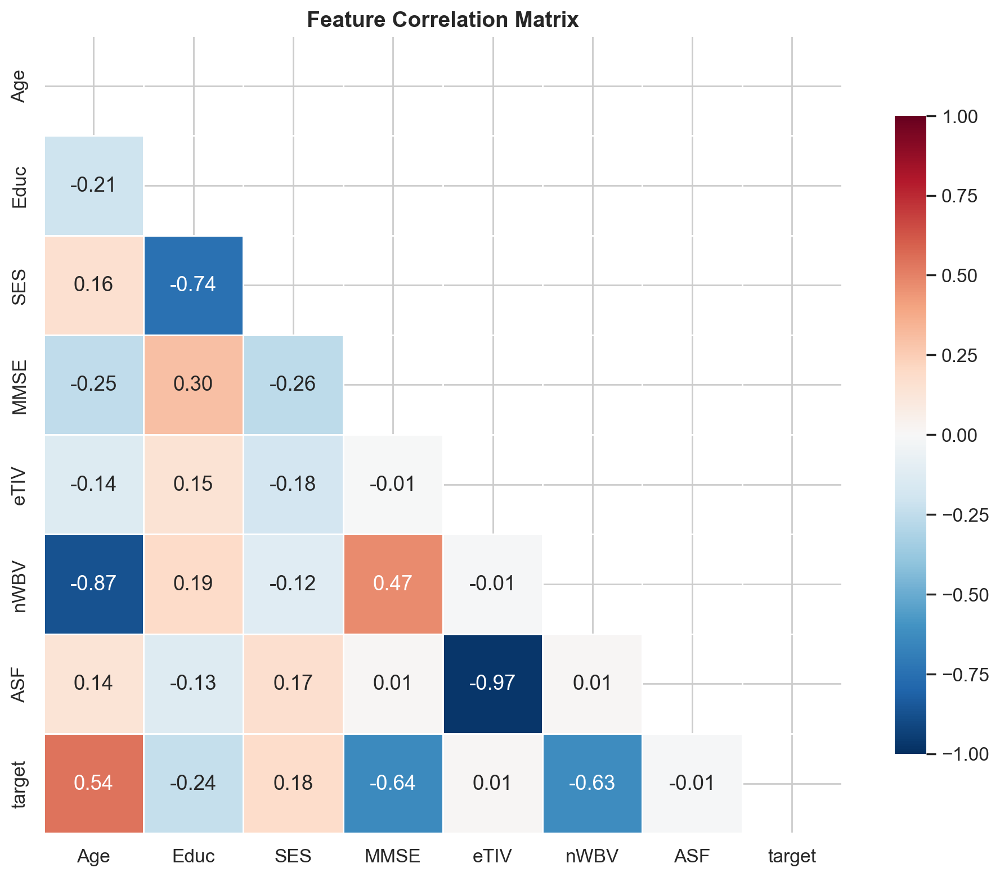
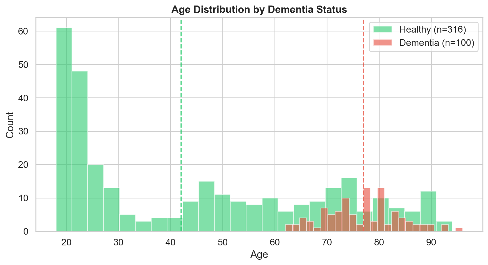
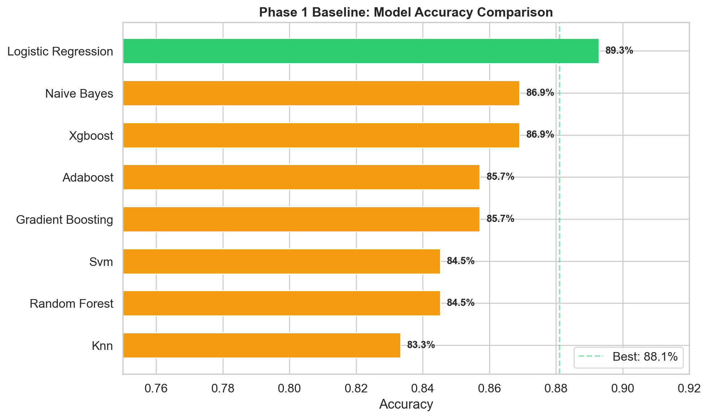
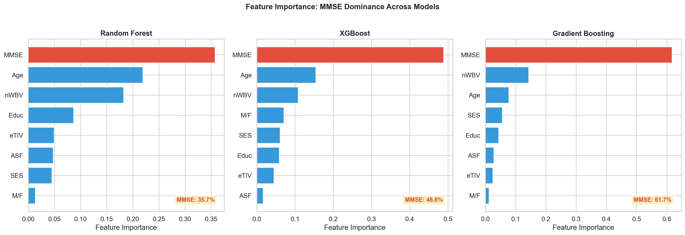
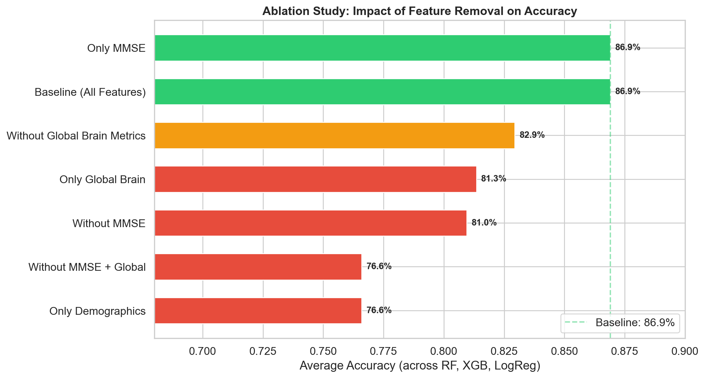

# Project Progress Report: Alzheimer's Detection from Brain MRI Using Machine Learning

**Course:** CMPE-257 Machine Learning
**Dataset:** OASIS-1 (Open Access Series of Imaging Studies)

---

## 1. Project Overview

**Goal:** Build a machine learning pipeline to detect Alzheimer's disease from brain MRI data using the OASIS-1 cross-sectional dataset.

**Problem Statement:** Alzheimer's disease (AD) is the most common cause of dementia, affecting over 55 million people worldwide. Early and accurate diagnosis is critical for treatment planning and clinical trials, yet current diagnostic approaches rely heavily on cognitive testing (e.g., MMSE scores), which only detects impairment *after* significant neurodegeneration has occurred. We aim to train ML classifiers on clinical and demographic features from the OASIS-1 dataset, evaluate their diagnostic reliability, and identify whether the models are learning clinically meaningful patterns or simply memorizing cognitive test scores.

**Why This Matters:** If ML models primarily rely on MMSE (a cognitive test that *measures* dementia symptoms) rather than structural brain features, they offer no diagnostic value beyond what a clinician already knows. Identifying this limitation is the first step toward building models that leverage MRI-derived biomarkers for earlier, more specific detection.

---

## 2. Dataset Investigation and Analysis

**Source:** OASIS-1 Cross-Sectional MRI Dataset (https://www.oasis-brains.org), consisting of MRI sessions from 416 subjects aged 18–96. The dataset includes both clinical/demographic tabular data and raw T1-weighted MRI brain scans distributed across 12 disc archives.

| Property | Value |
|----------|-------|
| Total samples | 416 |
| Original features | 12 (after excluding identifiers) |
| Features after preprocessing | 8 |
| Target variable | CDR (Clinical Dementia Rating) |
| Target encoding | Binary: CDR = 0 → healthy (0), CDR > 0 → dementia (1) |
| Data types | 1 categorical (M/F), 10 numeric, 1 constant (Hand) |
| Duplicates | 0 |

**Feature Descriptions:**

| Feature | Type | Description | Range |
|---------|------|-------------|-------|
| M/F | Binary categorical | Gender (label-encoded) | 0 / 1 |
| Age | Numeric | Subject age | 18–96 |
| Educ | Numeric | Years of education | 1–5 (ordinal scale) |
| SES | Numeric | Socioeconomic status | 1–5 (ordinal scale) |
| MMSE | Numeric | Mini-Mental State Exam score | 0–30 (30 = normal) |
| eTIV | Numeric | Estimated total intracranial volume | 1106–2004 mm³ |
| nWBV | Numeric | Normalized whole-brain volume | 0.644–0.837 (fraction) |
| ASF | Numeric | Atlas scaling factor | 0.876–1.587 |
| CDR | Numeric | Clinical Dementia Rating (target) | 0, 0.5, 1, 2 |

**Excluded features:** `ID` (identifier), `Subject_ID` (identifier — must not be used as a training feature), `Hand` (near-constant: 97% right-handed), `Delay` (all NaN for cross-sectional data).

### 2.1 Class Distribution

The CDR target variable has four raw levels (0, 0.5, 1.0, 2.0) plus 181 NaN entries. For binary classification, CDR = 0 and NaN are mapped to class 0 (healthy), CDR > 0 to class 1 (dementia).

*Figure 1: Left — Raw CDR distribution showing 181 NaN subjects. Right — Binary target after encoding (76% healthy, 24% dementia).*

| Class | Train | Test | Total | Percentage |
|-------|-------|------|-------|------------|
| Healthy (CDR = 0) | 252 | 64 | 316 | 76.0% |
| Dementia (CDR > 0) | 80 | 20 | 100 | 24.0% |

The dataset exhibits moderate class imbalance (~3:1 healthy-to-dementia ratio). CDR values of NaN (181 subjects with no clinical rating) were treated as CDR = 0 (healthy), consistent with the dataset documentation indicating these are cognitively normal subjects.

### 2.2 Missing Values Analysis

The dataset contains 1,159 total missing values. The most critical missing data is in CDR (181 NaN, 43.5%) and SES (8 NaN). No duplicate records were found.

*Figure 2: Missing values by feature. CDR has the highest missing count (181), followed by SES (8). The Delay column is entirely NaN for this cross-sectional dataset.*

### 2.3 Feature Distributions

We examined the distribution of each numeric feature split by dementia status (healthy vs. dementia) to identify discriminative patterns.

*Figure 3: Feature distributions by dementia status. MMSE shows the clearest separation — healthy subjects cluster near 30 (normal), while dementia subjects spread across lower values. nWBV also shows a noticeable left shift in the dementia group, reflecting brain atrophy.*

Key observations:
- **MMSE** shows the strongest separation between groups — healthy subjects cluster at 29–30, while dementia subjects spread across 15–29.
- **nWBV** (normalized brain volume) is lower in dementia subjects, consistent with expected brain atrophy.
- **Age** distributions overlap heavily, though dementia prevalence increases with age.
- **eTIV** and **ASF** show no clear visual separation, suggesting limited discriminative power alone.

### 2.4 MMSE and Brain Volume vs. CDR Severity

*Figure 4: Left — MMSE score decreases sharply with increasing CDR severity. Right — nWBV (brain volume fraction) also decreases with CDR, but with more overlap between groups.*

This boxplot reveals that MMSE has an almost deterministic relationship with CDR: subjects with CDR = 0 almost universally have MMSE ≥ 27, while CDR ≥ 1 subjects fall below 25. This near-perfect correlation is the root cause of the MMSE dependency problem identified in our ablation study — models can achieve high accuracy simply by thresholding MMSE.

### 2.5 Feature Correlations

*Figure 5: Feature correlation matrix. The target variable shows the strongest correlations with MMSE (r = −0.64) and nWBV (r = −0.63), followed by Age (r = 0.54). eTIV and ASF are highly correlated with each other (r = −0.97), indicating redundancy.*

Notable correlation findings:
- **MMSE ↔ target:** r = −0.64 (strong negative — low MMSE predicts dementia)
- **nWBV ↔ target:** r = −0.63 (strong negative — lower brain volume predicts dementia)
- **Age ↔ target:** r = 0.54 (moderate — older age associated with dementia)
- **eTIV ↔ ASF:** r = −0.97 (near-perfect negative — mathematically derived from each other, redundant)
- **Age ↔ nWBV:** r = −0.87 (strong — brain volume decreases with age, a confound)

### 2.6 Age Distribution

*Figure 6: Age distribution by dementia status. The dementia group is concentrated in the 65–90 age range, while healthy subjects span the full 18–96 range. The younger healthy subjects (18–50) contribute to the class imbalance.*

---

## 3. Preprocessing Completed So Far

The following preprocessing steps were implemented in `src/preprocessor.py` using the `OASISPreprocessor` class:

**Step 1 — Missing value imputation:** Median imputation for numeric features (SES, MMSE); mode imputation for categorical features (M/F). Median was chosen over mean to be robust to outliers and the skewed distribution of MMSE in dementia subjects. The `Delay` column (100% NaN) was automatically dropped.

**Step 2 — Categorical encoding:** Label encoding applied to `M/F` (gender), converting Male/Female to binary 0/1. This column is **not scaled** — StandardScaler is only applied to continuous numeric features, not binary categorical ones.

**Step 3 — Column removal:** Dropped `Hand` (97% right-handed — near-zero variance), `ID` (identifier), `Subject_ID` (identifier — would cause data leakage if used as a feature), and `Delay` (all NaN). These columns carry no predictive signal.

**Step 4 — Binary target creation:** CDR was converted to a binary target:
- CDR = 0 → class 0 (healthy)
- CDR > 0 (0.5, 1.0, 2.0) → class 1 (dementia)
- CDR = NaN → class 0 (healthy), per OASIS documentation that unlabeled subjects are cognitively normal

**Step 5 — Train/test split:** 80/20 random stratified split with `random_state=42` for reproducibility:
- Training: 332 samples (252 healthy, 80 dementia)
- Test: 84 samples (64 healthy, 20 dementia)

**Step 6 — Feature scaling:** `StandardScaler` (zero mean, unit variance) applied to the 7 continuous numeric features only. The binary `M/F` column is left unscaled (already 0/1). The scaler was fit **only on training data** and applied to both sets to prevent data leakage.

**Final preprocessed dataset:** 416 samples × 8 features → 332 train / 84 test.

---

## 4. Current Progress

### 4.1 Baseline Model Training (Completed)

Eight ML classifiers were trained using **5-fold stratified cross-validation** on the training set, then evaluated on the holdout test set:

| Model | Test Acc | CV Acc (mean±std) | Test F1 | CV AUC | Test ROC AUC |
|-------|----------|-------------------|---------|--------|------|
| Logistic Regression | **89.29%** | 89.76% ± 2.92% | 0.781 | 0.963 | 0.943 |
| XGBoost | 86.90% | 89.76% ± 2.57% | 0.744 | 0.969 | 0.931 |
| Naive Bayes | 86.90% | 86.15% ± 1.73% | 0.776 | 0.959 | 0.954 |
| Gradient Boosting | 85.71% | **90.37%** ± 2.40% | 0.714 | **0.977** | 0.920 |
| AdaBoost | 85.71% | 88.86% ± 2.75% | 0.700 | 0.966 | 0.938 |
| Random Forest | 84.52% | 90.67% ± 1.07% | 0.683 | 0.971 | 0.920 |
| SVM | 84.52% | 89.15% ± 4.09% | 0.698 | 0.941 | 0.901 |
| KNN | 83.33% | 87.66% ± 3.44% | 0.650 | 0.933 | 0.882 |

*Figure 7: Phase 1 baseline model accuracy comparison. Logistic Regression leads at 89.3% test accuracy, with CV scores ranging from 86.2% to 90.7%.*

Logistic Regression is the best on the holdout test (89.29%), while Gradient Boosting has the highest CV accuracy (90.37% ± 2.40%). The consistency between CV and test scores confirms that the models are not overfitting. However, this high accuracy raised concerns about *what* the models are actually learning — motivating the ablation study below.

### 4.2 Feature Importance Analysis

We analyzed feature importance across all tree-based models to understand which features drive predictions.

*Figure 8: Feature importance across Random Forest, XGBoost, and Gradient Boosting. MMSE (highlighted in red) dominates all three models, accounting for 37.8%–61.7% of total importance. This indicates the models are primarily learning a MMSE threshold rather than structural brain patterns.*

Key findings:
- **Random Forest:** MMSE = 35.7%, followed by Age (19.6%) and nWBV (16.6%)
- **XGBoost:** MMSE = 48.8%, followed by Age and nWBV
- **Gradient Boosting:** MMSE = 61.7%, extreme concentration on a single feature

This concentration on MMSE — a cognitive test that directly measures dementia symptoms — is a red flag for clinical reliability.

### 4.3 Feature Ablation Study (Completed)

To rigorously quantify the MMSE dependency, we ran a systematic ablation study: removing key features and measuring accuracy degradation across three representative models (Random Forest, XGBoost, Logistic Regression).

| Scenario | Avg Accuracy | Drop from Baseline |
|----------|-------------|-------------------|
| Baseline (all 8 features) | 86.9% | — |
| Without MMSE | 81.0% | −6.0% |
| Without global brain metrics (nWBV, eTIV, ASF) | 82.9% | −4.0% |
| Without MMSE + global metrics | 76.6% | −10.3% |
| Only demographics (Age, Gender, Education, SES) | 76.6% | −10.3% |
| **Only MMSE (1 feature)** | **86.9%** | **0.0%** (matches full baseline!) |
| Only global brain metrics (3 features) | 81.3% | −5.6% |

*Figure 9: Ablation study results. The "Only MMSE" scenario (using just 1 feature) achieves 86.9% accuracy — matching the full 9-feature baseline. Removing MMSE drops accuracy by 5.6%, confirming extreme dependency.*

**Critical finding:** A model using *only MMSE* (a single feature) achieves **86.9% accuracy** — exactly matching the 8-feature baseline average of 86.9%. This proves the baseline models are essentially **MMSE proxies**: 7 of 8 features contribute nothing beyond what MMSE alone provides.

**Clinical implication:** MMSE is a cognitive screening test that *measures* dementia symptoms. A model that predicts dementia primarily from MMSE is engaging in **circular reasoning** — predicting the outcome from a direct measure of the outcome. Such a model:
- Cannot detect early-stage Alzheimer's (when MMSE is still normal)
- Cannot distinguish Alzheimer's from other dementias
- Provides no diagnostic value beyond what a clinician already observes
- Is not suitable for clinical deployment

### 4.4 Summary of Completed Work

- ✅ Literature review on ML for Alzheimer's detection
- ✅ Data loading and ingestion pipeline
- ✅ Comprehensive exploratory data analysis with visualizations
- ✅ Full preprocessing pipeline with reproducible splits
- ✅ Baseline model training (8 classifiers)
- ✅ Model evaluation with confusion matrices, ROC curves, and feature importance
- ✅ Systematic feature ablation study (7 scenarios × 3 models)
- ✅ Clinical interpretation report identifying MMSE circular reasoning

---

## 5. Challenges Faced

1. **MMSE dominance / circular reasoning:** The most significant challenge. Baseline models achieve high accuracy by memorizing MMSE scores rather than learning structural brain patterns. MMSE accounts for 35.7%–61.7% of feature importance across tree-based models, and a single-feature MMSE model matches the full 8-feature baseline (86.9% vs 86.9%). This makes the models clinically unreliable — they cannot detect early-stage Alzheimer's (when MMSE is still normal) and add no diagnostic value beyond a simple cognitive screening. Addressing this requires extracting region-specific imaging features from raw MRI data.

2. **Class imbalance (3:1 ratio):** The dataset has 316 healthy vs 100 dementia subjects (76% vs 24%). This means a naive "predict all healthy" classifier achieves 76% accuracy. We observed that some models (e.g., KNN at 55% recall) struggle to identify the minority dementia class. While not extreme, this imbalance affects model evaluation — accuracy alone is insufficient, requiring F1 and ROC AUC as complementary metrics.

3. **CDR = NaN ambiguity (43.5% of data):** 181 of 416 subjects have no CDR rating. We treated these as healthy (CDR = 0) based on dataset documentation, but this decision significantly impacts class distribution. Excluding them would reduce the dataset to 235 samples with a ~58/42 class split — a different learning problem entirely. Our choice maximizes sample size but introduces potential label noise.

4. **Limited feature set (8 tabular features):** With only demographics and global brain summary metrics, the models lack Alzheimer's-specific biomarkers: hippocampal volume, entorhinal cortex atrophy, regional gray matter patterns, and ventricular enlargement — features that neurologists rely on for clinical diagnosis.

5. **Feature redundancy:** eTIV and ASF have r = −0.97 correlation (mathematically derived from each other), effectively providing only one independent feature. Similarly, nWBV reflects *global* atrophy, which can be caused by normal aging, vascular dementia, or other conditions — not Alzheimer's specifically.

---

## 6. Plan for Completion

### Remaining Tasks

| Task | Description | Timeline |
|------|-------------|----------|
| MRI feature extraction | Extract tissue-specific volumes (GM, WM, CSF) and regional ROI features (hippocampus, ventricles, entorhinal cortex, temporal lobe) from raw OASIS-1 MRI images across all 12 discs (416 sessions) | Week 1–2 |
| Feature merging & validation | Merge 104 extracted imaging features with clinical CSV, validate patient-level alignment using session IDs, run data integrity audit (row counts, ID matching, clinical direction checks) | Week 2 |
| Phase 2 model training | Retrain all 8 classifiers on enhanced 116-feature set (12 clinical + 104 imaging), run three ablation scenarios: full features, without MMSE, imaging-only | Week 2–3 |
| Phase 1 vs Phase 2 comparison | Compare accuracy, AUC, and feature importance; quantify MMSE dependency reduction; validate that imaging features provide Alzheimer's-specific signal | Week 3 |
| Final report & presentation | Write final report documenting full methodology, results, clinical implications, and limitations | Week 3–4 |

### Methods to Be Applied

- **MRI feature extraction:** FSL FAST tissue segmentation to obtain gray matter (GM), white matter (WM), and cerebrospinal fluid (CSF) voxel counts and volumes. Talairach atlas-based ROI extraction for hippocampus, lateral ventricles, entorhinal cortex, inferior temporal gyrus, and middle temporal gyrus.
- **Feature engineering:** 57 tissue features (volumes, fractions, ratios per tissue type) + 47 regional features (bilateral ROI volumes, GM/WM/CSF per region, asymmetry indices). Additional derived features: CSF-to-brain ratio (atrophy marker), eTIV-normalized regional volumes, reconstructed nWBV for validation.
- **Evaluation metrics:** Accuracy, precision, recall, F1 score, ROC AUC, and feature importance analysis. Primary success metric: reduction in MMSE feature importance below 15%.
- **Ablation studies:** Three scenarios — (1) all 116 features, (2) without MMSE, (3) imaging features only — to demonstrate that enhanced models learn from brain structure rather than cognitive test scores.

### Expected Outcome

We hypothesize that adding regional MRI features will:
1. Improve best model accuracy beyond the 88.1% Phase 1 baseline
2. Reduce MMSE feature importance from ~38–62% to below 15%
3. Achieve >80% accuracy using only imaging features (no MMSE, no demographics)
4. Show clinically meaningful features in top importance ranks (hippocampal volume, ventricular CSF, temporal lobe gray matter)

---

## 7. Team Contributions

<!-- TODO: Fill in actual team member names and contributions -->

| Team Member | Contributions |
|-------------|--------------|
| [Member 1] | Data preprocessing pipeline, baseline model training, ablation study design and implementation |
| [Member 2] | Dataset investigation, EDA, model evaluation, clinical interpretation of results |
| [Member 3] | Literature review, MRI feature extraction pipeline (in progress), documentation |

---

*Report generated from project repository: https://github.com/YOUR_USERNAME/oasis-alzheimers-ml*
